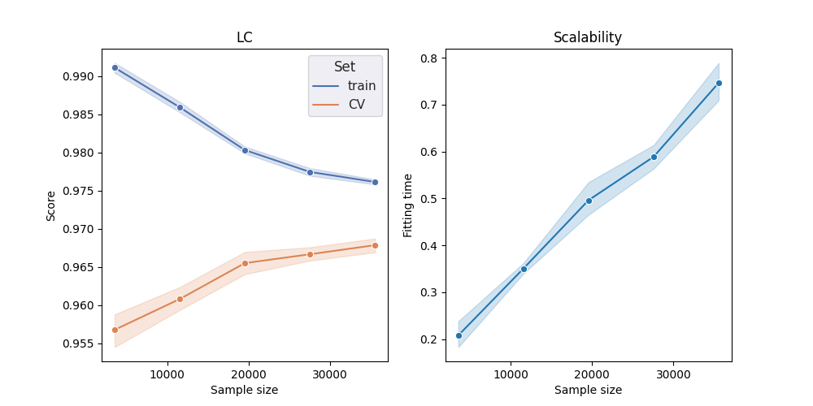
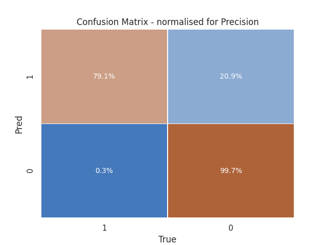

# Assignment

My attempt at tackling some of the challenges stated in the  take-home case study.

## Introduction

This README is the accompagnying deliverable document to the given case study. It describes the work conducted for this take-home data science assignment.    
  
Its main sections match the measures of improvements steps that are stated in the case study - these have driven the work. 
To showcase working mechanics, I choose a github repository for code, and github notes/issues for tasks break-down.  
  
Codes, reports and figures can be found in [here](https://github.com/marcalph/assignment) (provided you are not already reading this on github).  
  
> While this document is hopefully not hard to read, I strongly advise the reader to acquaint him/(her)self with these sections through the corresponding project board, [here](https://github.com/marcalph/assignment/projects/1).  
The cards offer a more practical overview through a Kanban.

### Disclaimer

- while data quality was risen as a possible issue, I essentially consider data to be holding the truth (even regarding dramatic time range between moving for example);  
- doing this case study, I came to realise in the recent years (2 or so) I spent a growing time doing deep learning over "traditionnal" data science, so I spent a fairly large amount on the case study because of time spent recoding snippets that were not available in my collection anymore...; 
- some tasks may appear closed while not completed or vice-versa because of a lack of understanding of what constitute the definition of done; I probably spent around the 15 hours mark for this assignment.

## Repository checks and description

#### Repo checks
This repository follows my usual code layout for a work project.  
As a mean to enforce good data science practices, I have tried to include traditionnal software engineering tools:  

- an src layout;
- unit tests;
- code linting & formatting;
- ~~typing~~\*;
- a working demo.

\* well...ok maybe I fell short of time at some point
  
#### Repo description
  
The main folders of this repository are:  

- assets \> basically all the static files;
- demo \> the demo contianer configuration files;
- src \> the actual code splitted into scripts;
- test \> minimal tests;

## Baseline mock

The first task I tackled or rather attempted was to replicate the model described as a baseline in the case study. Spoiler alert: I failed miserably...

Several reasons motivated this choice:

- The model is "simple";  
   For the record, it is described as a logistic regression model with an elastic net penalty (i.e. L1 et L2 regularization) thus easy to train on a limited computational budget.
- Some of the data at hand has already been cleaned;
   This allows to iterate quickly without spending too much time on a thorough data analysis.
- It is a habit ;
- It allows to develop a minimal end-to-end pipeline showcasing all the usual/essential steps of a ML project and gives solid grounds to build things further up.

The chosen pipeline, is described hereafter : 
1. EDA (exploratory data analysis)
2. Data processing
3. Model training
4. Model review
5. Model testing 
6. Exposition (which is viewed as mean to end-to-end testing and UATs)

A detailed description of this section can be found [here](baseline.md)

## Model Interpretability
  
The idea of a interpretable model is a somewhat abstract one, as even linear model tend to be dramatically hard to understand depending on the features or preprocessing at hand (high number of features, scheme of encoding, splines, exotic links function...).  
  
That being said model interpretability is almost systematically a key feature of a project - as however well performing a model can be, its perceived lack of transparency by the users can prevent its adoption.  
   
Common tools and frameworks, for this task are graphical ones.   
  
Be it, partial dependency plots, individual conditional expectations, `shap`, `lime` and `captum`.  
  
If captum is usually my prefered choice, is it almost exclusively used in a deep learning context (a `pytorch` one at that).  
Conceptually, Shapley values seems to be the most elegant solution to interpretabilityand the most solid technically speaking, but I find `lime` easier to explain and computationaly more efficient.  
For this reason, it is the main approach taken here and is avalaible as a dedicated endpoint in the accompanying demo container/API.  
  
Nevertheless, both approach are used in this case study, and codes are available at **src/utils/interpret.py**. 

An example of the interpretabilty tool is  available in the reports **assets/output/reports** folder.

## Feature engineering

Feature engineering can essentially be viewed as a hyperparameter tuning. Feature engineering wasn't an issue I intented to tackle in this case study, but as the baseline highlighted the **clean** dataset was submitted to one-hot encoding processing, which is subpar for some models, including tree-based ones.
  
Basic components are the imputation scheme, the feature encoding and normalization techniques used and the construction of features.
  
As form of tuning, a decent feature strategy needs to be evaluated. What should have been done ideally is to replicate the existing feature processing pipeline (used to create the **clean** dataset, and test that the subcomponents - imputation and bining mainly -  maintain the performance of the baseline.  

But the performance review of the baseline highlighted the need for higher variance estimators of the decision rule.  
It feels, that tree boosting is a reasonnable first choice given that other candidates (feed-forward neural networks for example) may suffer from the low volume of data at hand.  

  
### Tree grounded feature engineering
  
As a consequence, feature processing resulted mainly in :
- imputing missing variable with an eponymous category or `-1`;
- label encoding of *categorical* variables;
- splitting of *date* features;
- no scaling was done as tree are used;
  

###  Feed Forward Neural Net grounded feature engineering
  
Feature processing for neural networks is basically non-existent because it mainly consists in scaling the inpput features.  
That being said, the advantage of neural network for tabular data is the capacity to learn meaningful representation of categorical data through embeddings.  
  
Code is available in **src/model_architecture.py**.

## Model /Model Architecture

As discussed in the baseline section, the current baseline is showing a relatively high bias regarding the task at hand.  

I feel that both tree-based methods and neural architectures are good candidates to mitigate this bias.
  
### Tree Based Gradient
Despite my love for deep learning, the first model reported is a tree-based gradient boosting method (I ruled out forest based classifiers because, in my experience, they tend to give subpar results in similar data contexts).  

Obvious contenders include `xgboost`, `sklearn`, `catboost` and `lightgbm`. The Microsoft package gets hands down, the spotlight.  
  
In my experience, it almost always get top performance while being ridiculously fast to train. I therefore chose to use `lightgbm`; also at this point the codebase seemed to gravitating towards the scikit-learn API, which is supported by the package.

First records show outstanding improvements over AUROC, with reported test AUC of `96.7%`.  
Training logs can be found in the **assets/output/logs** folder.
  
Given these huge improvements, it may be interesting to reassert relevant next steps.  
Let's review model performance:  
  
  
This time learning curves (for AUROC) exhibit a saner pattern with a little bit of variance - such that the model would naturally improve with more data.  

 
Confusion matrix are looking better with an improved diagonal, precision is now much more acceptable given the task at hand.

### Feed forward neural network

OK, code was only prototyped for this...
You can look at it in the **src/model_architecture.py** script.

### Reflexion on metrics  
On a side note, the boosting model was tuned using average precision rather than AUROC.  
Average precision seems like a better alternative because it considers true positive rate (TPR) and precision, while the ROC AUC considers only TPR and FPR being a more "recally"  metric. 
That being said, the modeling capabilities of the boosting models seems to nullify this argument for hyperparameter tuning.  

I feel however, that the metric is a topic that needs to be extensively discussed with business teams. 

It is tied to business considerations, given a less than perfect model one might consider that performance is key indeed but matters only until a specified rank (because lead transformation is limited by workforce capacity for example).
Precision@k seems very well suited for such a case, or any @k metric for that matter.  We the might want to optimize a cutoff average precision...

We might also consider that ranking is of uttermost importance and modelize the graded relevance - as it is indeed the case for the origin domain set of the target. We might consider something like (normalized) Discounted Cumulative Gain.

So while it feels that there is no direct answer for the ideal metric, it also feels that it should be something along Information Retrieval. I believe that stacking alongside different problem framing could be a killer feature.

Also, I mention here that improving the results in this specific context might have to do with optimizing the to-be-chosen metric directly.  
Which is a relatively easy to midly painful task given the model (recoding logistic regression with a DL framework for example with custom loss, or fitting a boosting machine directly on the ranks vs optimizing a strongly non-cooperative loss).

## Demo / Staging environment

This part is covered in the baseline.

