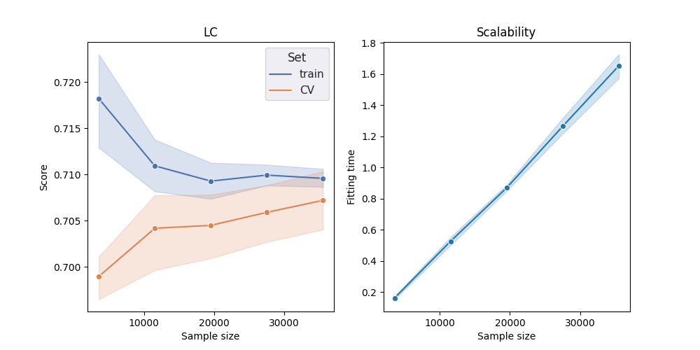
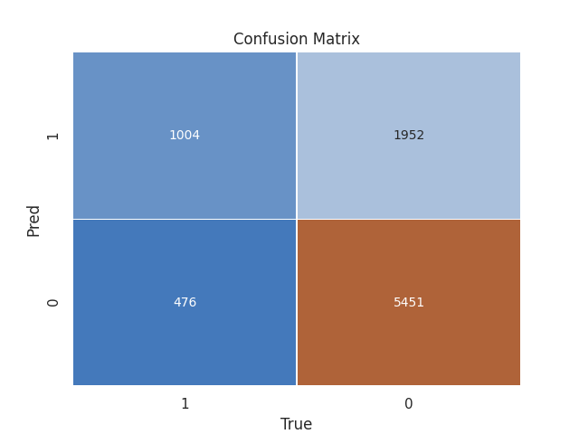
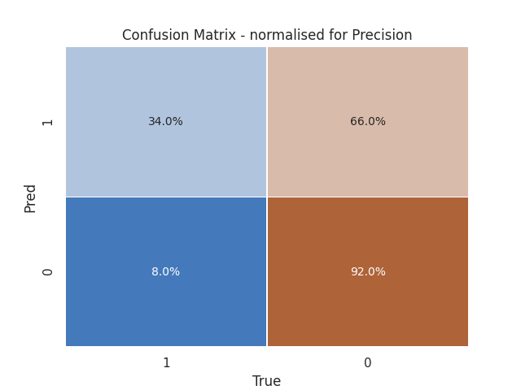

## Baseline mock description

### 1.EDA
The conducted analysis is small because of the explicit instructions of the assignment.
As a result, EDA was done simply using `pandas_profiling` generating explorative reports as html documents - code can be found in the **src/eda.py** script.
Said reports can be found in the repo under [assets/reports](assets/output/reports).
The vast majority of the time spent was on the raw dataset, because it gives decent founding grounds for the future feature engineering step.

#### **case_study_scoring_raw.csv**

- `raw["country"]` has constant value, should not be a problem from a machine learning perspective;
- Some attention has to be drawed to the fact that a number of variables exhibit high cardinality and/or either missing or zeros;
- There is highly correlated pairs of features.

Questions that arose when first looking at the report were:
- Is there a data leak using `raw["contact_status"]`?
- Can we use `raw["previous_max_stage"]`? The definition set doesn't match dataset specifications.
- Is variable `raw["count_previous_opportunities"]` a number of sales cycles?
- Regarding variables `raw["count_total_calls"]`, `raw["count_unsuccessful_calls"]`, what is the definition of success?

#### **case_study_scoring_clean.csv**

- Dataset `clean` has a lot of duplicate values;
- `clean["has_last_inbound_lead"]` has constant value;
- There is also highly correlated pairs.

Features appear to have been heavily preprocessed with a one-hot encoding scheme.
It seems to be a reasonnable choice given that it allows linear models to encode more easily non-linear relationships, paying a small price in degrees of freedom in exchange.
The bining choices of feature values will not be discussed as it would require extensive data analysis, but it is an obvious improvement opportunity regarding the feature engineering scheme.

In both cases, target exhibits an imbalance of `16.7%`.

### ~~2. Data processing~~~

The data processing step was not conducted at this stage because data was already cleaned and preprocessed.
Basically, it appears all features were turned into one hot encoded vectors, which is kind of in adapted for linear models.

### 3. Model training

The scoring problem is framed as a binary classification problem, with a ranking twist (as it is the real objective). Where the target is:

$$app = P("converting\ during\ cycle")$$

Given the fairly "small" amount of data, the first thing to do is to design a solid cross-validation (CV) strategy.
Both datasets show a sample size of around `44000`. I chose a test size of 20% - test sizes usually go from 1% to 25% depending on the data at hand; beacuse for an improvement in accuracy (the default metric classification-wise) of 0.1 point, a test size of 20% guarantees a sample support of 9 (`44000 x 20% x 0.1% = 8.8`).
Choice is arbitrary but constitutes a large enough base for a variation in metric evaluation not to be considered random.

Announced metric is AUROC (Area Under Receiver Operating Characteristic curve) which is again common and tied to ranking. Alternative, metrics are discussed in the model section.
The strategy retained was a nested CV variation because non-nested CV strategy tend to lead to overly confident results.
The retained strategy was build around stratified shuffles for the train/test split and a 5fold cross-validated gridsearch for the further sub-splitting into training and validation sets.
The gridsearch was conducted to mainly assess correct hyperpamaters regarding regularization penalty strength and blending. The resulting models were mostly ridge version of a logistic regression with a relatively strong regularization. Given the imbalance mentionned earlier, a class weight penalty was used for the loss.
I didn't manage to fully replicate the described baseline results which showed a test AUC of `0.75` whilst mine stagnated at `0.7071`.
I therefore coded a non-nested version of the same CV strategy and came up with a val AUC of around `0.77`, this time resulting models were elasticnet versions of the logistic estimator - the type of model gridsearch outputs and the smaller AUROC are starting evidence of a discrepancy in CV strategy.
Code is located at **src/baseline.py**.
Training logs are available aunder [output/logs](assets/output/logs).

### 4. Model review

Given a model, the logical next step is to assess its performance.
Apart from evaluation metric already reported other tools allow a more thorough diagnostic of model performance.
The model review utilities that I hand-picked for this assignment are:

- the learning curves;
- a confusion matrix;
- a list of the most incorrect predictions of the model.
   "Most incorrect" meaning incorrect predictions with an overly confident decision rule, I chose to generate a `pandas_profiling` report of these to enable the search of error patterns.

The constrained data volume guided development towards a cross-validated version of these tools.
Code for the learning curves and confusion matrix is located at **src/utils/train.py**.
Code for the incorrect report is in **src/baseline.py**.

The learning curves for the baseline model exhibit a high bias regime (relatively close training and validation scores and a somewhat stabilized training score).
This guides further model develoment towards higher variance methods provided predictive power is the objective. First candidates that come to mind are tree-based boosting and neural nets (with extra carefulness because of the relatively constraint data regime).

 

The confusion matrix associated denotes good overall predictive power but showcase a somewhat weak precision. This is in accordance regarding the chosen AUROC metric for the baseline.

The report grouping the most incorrect predictions can be found at [output/reports](assets/output/reports).

### 5. Model testing

Testing a model is inherently a tedious task because the traditionnal data science pipeline doesn't conform with test driven development. Given that the logic is learned by the model and "available" a posteriori.

I defined minimal testing regarding model output, for a binary classification problem.
Namely, is tested the fact that the model outputs correctly a binary response or a probability when asked.

Code is located at **tests/test_model.py**.

### 6. Exposition

As the final pipeline stage, I defined a simple REST API using the `FastAPI` framework, exposing the model and allowing for quick end-to-end testing of its response.
To guarantee reproducibility and comply with current best practices regarding CICD the API is exposed through a `docker` container in a stack defined by the files in **demo/\*** files.

The default choice for an API framework in python, moreover to expose a machine learning model is standardly Flask. I chose to use `FastAPI` because it natively supports ASGI and comes bundled with a really fast production-ready server (`Uvicorn`).
It aso generates natively a `Swagger` description for all the endpoints which gives a minimal UI whithout having to code for it.
The use of a Swagger rather than a graphic  interface was motivated by the picture painted in the assignment of an experienced PM.

Code is located at **src/app.py**.
Training logs are available at [link](todo).
